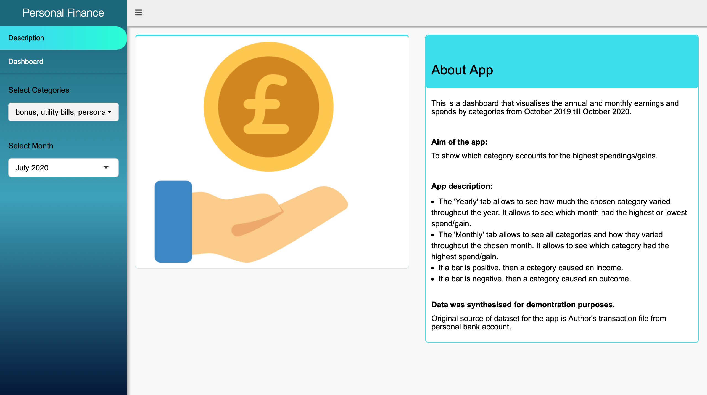
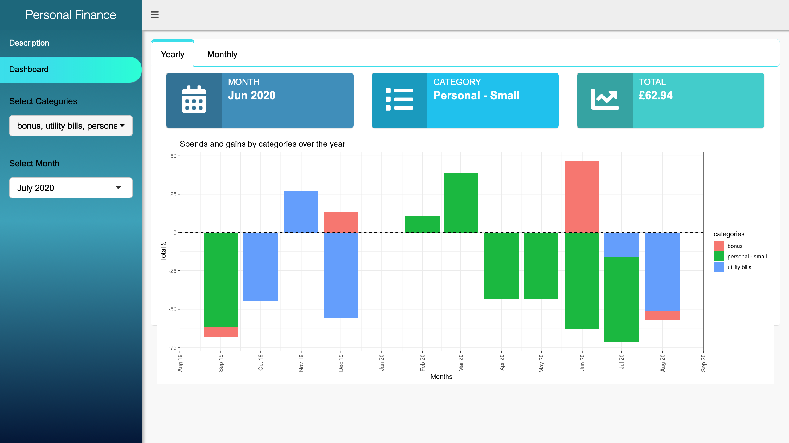
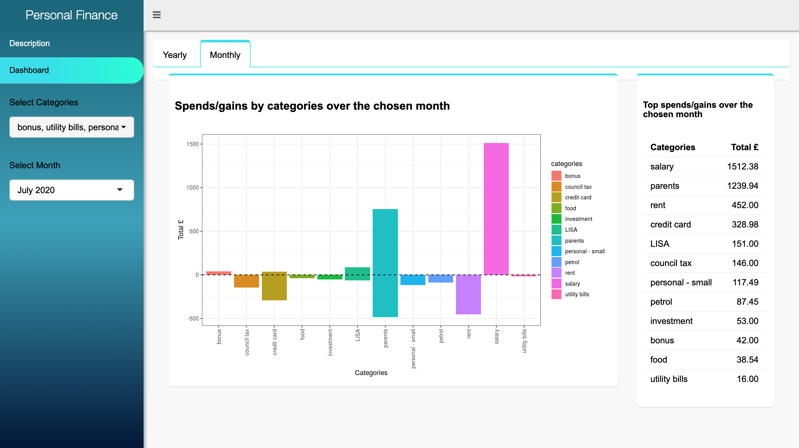

# Dashboard Personal Project

## Introduction
### Prehistory
When I started my first job after graduation from university and became independent from my parents, I quickly realised that my bank balance was always negative or close to zero before a pay day. 

Since then I became interested in Personal finance and started to read online articles about it. All experts had in common the same advice which was to start calculate the budget and plan it. Calculate earnings and spendings per month or week. 

At that time, my mobile bank app did not have budget and spendings tab so in December 2018, I started to use Microsoft Excel for regular monthly analysis of bank transactions in order to find the insights and finally start saving up money for various reasons.

### First personal project

After graduating with Data Analysis course from Code Clan, I have decided to do analysis over one year of my bank transactions using new tools such as R and Shiny.

**Synthetic dataset was created for demonstration purposes.** 
Original dataset is author's bank transactions over one year from Oct 2019 till Oct 2020.

## The dashboard
The user can explore and visualise the annual spends and gains by categories and monthly spends and gains by categories. The app has info boxes which point for the month and category with the highest spend/gain and table with top spends/gains over the chosen month. 

The link for the app can be found **[here](https://veronika13.shinyapps.io/annual_finances)**.

## Images 
### Description tab 

### Dashboard tab

## Packages
| Package      | Version    
| :------------- | :----------: 
base R | 3.6.0 |
shinyWidgets | 0.5.7 | 
dplyr | 1.0.2 |
ggplot2 | 3.3.3 |
tidyverse | 1.3.0 |
stringr | 1.4.0 |
here | 0.1 |
dashboardthemes | 1.1.3 |
readr | 1.4.0 |
tidyr | 1.1.2 |
purr | 0.3.4 |
shinydashboard | 0.7.1 |
shiny | 1.5.0 |
forcats | 0.5.0 |
tibble | 3.0.4 |
